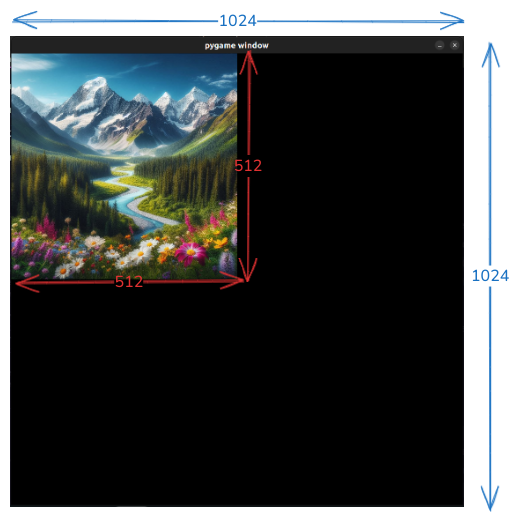
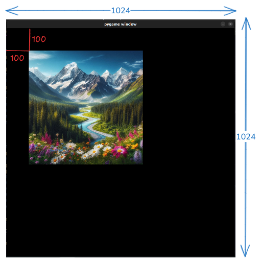
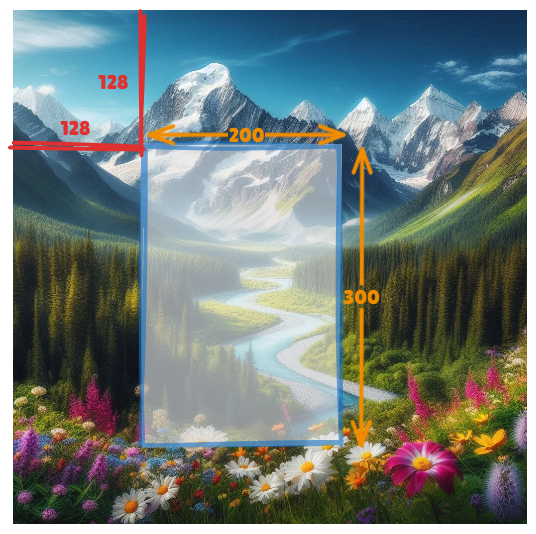
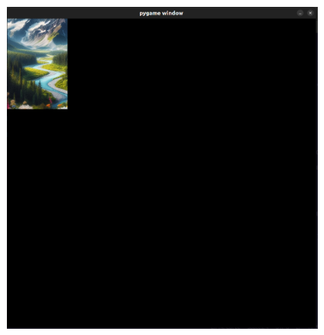
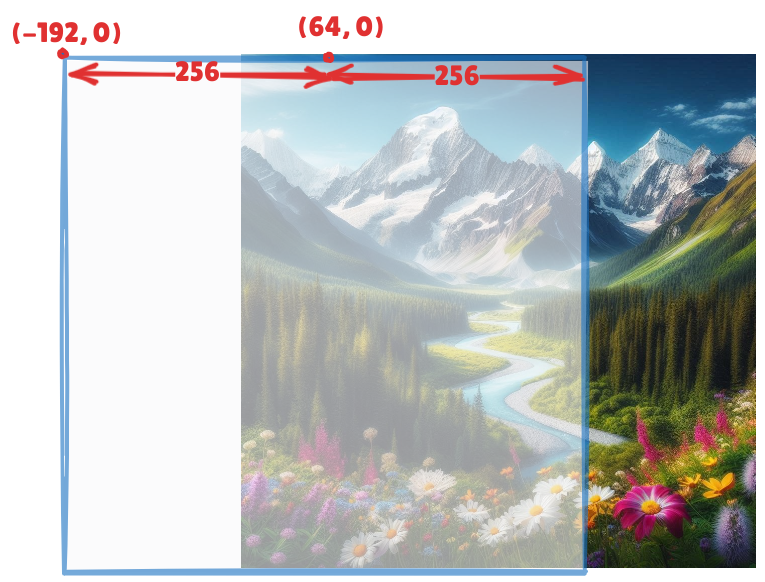
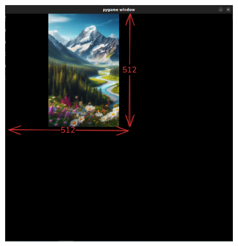

# Running Notes

## Learning Resources

* https://www.pygame.org/docs/
* https://www.pygame.org/docs/tut/newbieguide.html
* http://pygametutorials.wikidot.com/tutorials-basic
* https://www.patternsgameprog.com/series/discover-python-and-patterns/
* https://www.pygame.org/docs/tut/PygameIntro.html
* https://www.pygame.org/docs/tut/ChimpLineByLine.html
* https://www.pygame.org/docs/tut/MakeGames.html
* https://blog.pyodide.org/posts/0.26-release/
* https://ryanking13.github.io/pyodide-pygame-demo/
* https://www.makeuseof.com/pygame-touch-inputs-working-with/

## Rect

`Rect` is not connected to the actual surface at all. Getting a surface's rect is just a convenience method. Everytime I call `Surface.get_rect()` I get a different `Rect` object. When I get a rect of a surface, it will have the same dims as the surface. The rect's topleft will be `(0, 0)` and will coincide with the surface's top left. However, I can now move the rect around. It will move w.r.t to its initial position, i.e., w.r.t to the surface it was derived from.

## Blitting

When blitting one surface onto another, I typically call `dst_surface.blit(src_surface)`. This will copy the pixels of the `src_surface` onto the `dst_surface`. The top left of the source will be mapped to the `(0, 0)` of the destination. 

Output of `blitting/example1.py` -

```python
# screen is 1024 x 1024
# img is 512 x 512
# This will just paste the image to the top-left of the screen
screen.blit(img)
```




If I want to place the source somewhere else, I can just specify the coordinates. `dst_surface.blit(src_surface, (100, 100))` will align the source surface's top-left to `(100, 100)` of the destination surface. 

Output of `example2.py` -

```python
screen.blit(img, (100, 100))
```




Instead of a `Tuple[int, int]`, I can also give a `Rect`, the `blit` method will take `Rect.topleft`, it will discard the rest of the rectangle. 

I can also "crop" a portion of the source and copy that onto the destination. The way to do that is to specify the cropped section's rect. Lets say I want to crop the source surface starting from `(128, 128)` and width of 200 and height of 300. 



I want to copy this cropped surface at `(0, 0)` onto the destination. I can do this like so - `dst_surface(src_surface, (0, 0), Rect(x=128, y=128, width=200, height=300))`. See `blitting/example3.py`. 



Typically this kind of cropping and pasting the source at exact coordinates is useful when I am "erasing" the player from the background. Lets say we have the following three surfaces -

* `screen`
* `player`
* `bg`

Right now the `screen` has both `player` and `bg` blitted onto it. I want to remove `player` and blit the appropriate portion of the background onto the screen. The destination surface is the `screen` and the source surface is the `bg`. I want to crop the section of `bg` that matches the `player`. This is easy, I can just get the rect corresponding to the `player`. I want to place this cropped surface at the same coordinates as the current `player`. The cropped part will cover the current player because they are the exact same size. A "pattern" that I have seen for this is -

```python
player_rect = player.get_rect()
screen.blit(bg, player_rect, player_rect)
```


I can do some funny things with rect, move, and blit. Consider `blitting/example4.py`. I get the rectangle of the image. It is `(0, 0, 512, 512)`. I move this rectangle s.t its `centerx` is at 64. This means that half the image is on the left of `x = 64` and half is to the right. The image is 512 pixels wide. This means that it extends `512/2 = 256` pixels on both sides. The x-coordinate of the top left will be `64 - 256 = -192`.



Now, I blit the cropped image onto the screen at `(0, 0)` I end up with -



### Convert

Whenever I am blitting a surface onto the main display surface, it is a good idea to first `.convert()` the source surface so that it has the same pixel-format as the display. ==TODO: Figure out what is pixel-format.==. When I am creating surfaces that need to be blitted onto surfaces that are not screens, I haven't seen them being converted. E.g., when I create a text box to be blitted onto a background, I haven't seen the text box being converted.

## Examples

List of examples worth understanding in more detail -

1. aacircle
2. aliens
3. blend_fill
4. go_over_there
5. liquid
6. mask
7. setmodescale
8. stars

